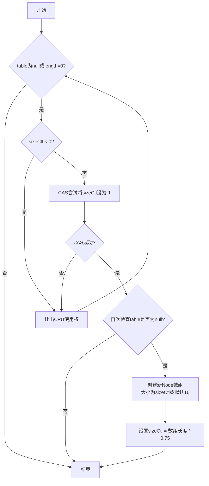

# JDK 1.8 之前

## 基本信息

底层通过 Segment 段 + 数组 + 链表实现。

线程安全通过对 Segment 加锁实现。

Segment 的数量在初始化时确定，无法动态改变，因此 Segment 的个数决定了 **最高并发线程数**（默认最多支持 16 个线程并发，具体取决于初始化时的配置）。

## 初始化

- 判断 ConcurrencyLevel 是否大于最大值，若大于则将其重置为最大值 65535，无参构造默认为 16
- 寻找 ConcurrencyLevel 以上最接近的 2 的幂（记为 $2^N$），作为 Segment 的数量
- ssize = $2^N$ （Segment 的数量）， sshift = $N$ ，smask = ssize - 1
- 初始化 Segment[0] ，默认大小为 2，负载因子为 0.75，扩容阈值为 2 * 0.75 = 1.5（下取整为 1）,所以当插入第二个元素的时候就会进行扩容。

## 插入元素

- 根据 key 计算出一个 hash 值用来确定 Segment 的位置（ `int segmentIndex = (hash >>> segmentShift) & segmentMask;`）
- 如果指定位置的 Segment 为 null ，则对其进行初始化
    - 从 segments[0] 获取配置信息（hashEntry长度、负载因子）
    - 根据配置信息新建 HashEntry[ ]
    - 再次检查该 Segment 是否已被其他线程初始化，如果确定未被初始化，则通过 CAS + 自旋来对该 Segment 进行初始化（可以粗糙地理解为将该 Segment 指向上面新建的 hashEntry[ ]）
- 执行插入逻辑
    - 加锁当前 Segment（ReentrantLock）
    - 找到对应的桶并插入或替换元素
    - 维护 count，扩容判断

## 扩容

Concurrenthashmap 的扩容只会扩容到原来的两倍。老数组里的数据移动到新的数组时，位置要么不变，要么变为 index + oldSize，参数里的 node 会在扩容之后使用**头插法**插入到指定位置。

# JDK 1.8 之后

## 基本信息

底层基于 Node 数组 + 链表 / 红黑树。当冲突链表达到一定长度时，链表会转换成红黑树。Concurrenthashmap 中有两个比较重要的成员变量：

- table：Node<K, V> 数组，每个槽位可以是null、链表或红黑树
- sizeCtl：通过不同值控制 table 初始化和扩容的参数

## 核心变量 sizeCtl

| 值范围                     | 意义                   |
| ----------------------- | -------------------- |
| `< 0`                   | 表示初始化或扩容中（-1 是初始化标志） |
| `= 0`                   | 无任何初始化信息，默认初始化为容量 16 |
| `> 0` 且 `table == null` | 初始化容量（自定义或默认）        |
| `> 0` 且 `table != null` | 扩容阈值（容量 × 0.75）      |

## 初始化

- 首先检查 table 是否为 null 或长度为 0，如是则需要初始化（懒加载）
- 检查 sizeCtl 值：
    - 若 sizeCtl < 0，表示有线程正在进行初始化或扩容，当前线程需要让出 CPU 使用权
    - 若 sizeCtl ≥ 0，则使用 CAS 操作尝试将 sizeCtl 设置为 -1（表示抢占初始化权）
        - CAS 成功（获得初始化权）：
            - 再次检查 table 是否为 null（防止其他线程已完成初始化）
            - 创建 Node[ ] 数组，大小为 sizeCtl 指定值或默认值 16
            - 更新 sizeCtl 为 table.length * 0.75（阈值，触发下次扩容的边界值）
        - CAS 失败（其他线程抢先初始化）：
            - 让出 CPU 使用权，进入下一轮循环等待初始化完成

## 插入元素

- 检查 Node[ ] 是否已初始化。若未初始化，则通过 CAS 确保只有一个线程能完成初始化工作.
- 基于键的哈希值计算目标桶位置。若目标桶为空（无冲突），则直接通过 CAS 操作安全地插入新节点作为桶的头节点。CAS 失败则重新循环尝试。
- 若发现目标桶位置的节点的标志位为 MOVED，表明当前 Map 正在执行扩容操作。此时，当前线程调用 helpTransfer() 协助完成扩容。
- 若目标桶已有元素，则对桶的头节点加 synchronized 锁（链表或红黑树的头结点）：
    - **链表结构**：遍历链表查找是否存在相同键。存在则更新值；不存在则在尾部添加新节点。
    - **红黑树结构**：执行树的插入算法，保持树的平衡性。
- 插入操作完成后，检查链表长度是否达到阈值（默认为 8）。若达到，则触发 treeifyBin() 方法尝试将链表转换为红黑树。转换前会先判断数组容量是否达到 MIN_TREEIFY_CAPACITY（64），若未达到则优先进行扩容而非树化。
- 最后通过 addCount() 更新节点计数，并检查是否需要扩容。若需要，则触发扩容操作，多线程协同完成。

# 线程安全的实现

在 **JDK 1.8 之前**，`ConcurrentHashMap` 采用了 **Segment 分段锁** 的设计来实现线程安全。

- **Segment** 是一种特殊的可重入锁，继承自 `ReentrantLock`，主要负责锁的管理。
- **HashEntry** 用于存储键值对数据，每个 `Segment` 负责守护一部分 `HashEntry` 数组中的元素。
- 当需要修改某个 `HashEntry` 数组中的数据时，必须先获取对应 `Segment` 的锁。
- 这种设计允许对 **不同的** **`Segment`** 同时进行并发操作，但对同一个 `Segment` 的操作则会发生阻塞。

在 **JDK 1.8 之后**，`ConcurrentHashMap` 取消了 `Segment` 分段锁，改为基于 **Node** + **CAS** + **`synchronized`** 的方式来保证并发安全：

1. **无哈希冲突时**：如果目标位置的桶（`Node[i]`）为空，直接通过 CAS 操作插入元素，无需加锁，效率更高。
2. **存在哈希冲突时**：对于非空桶（即目标位置已有元素），使用 `synchronized` 锁定桶内的链表头节点，确保并发修改的安全性。
    - 如果链表过长（默认长度超过 8），会将链表转换为红黑树以提升性能。
