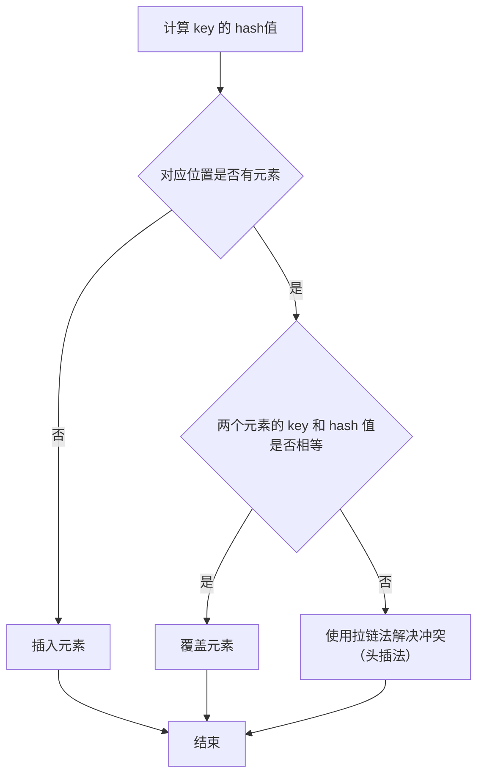
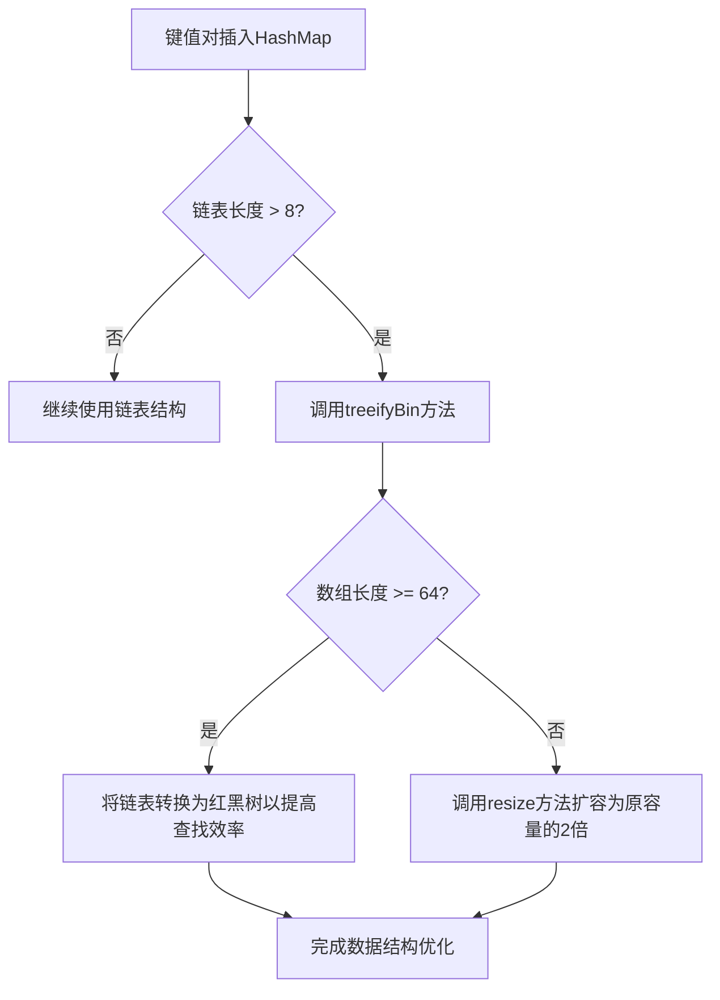

# 基本信息

- 实现接口: Map (Map是不继承Collection的)
- 线程安全：非线程安全
- 存储方式：key + value
- 对 Null key和 Null value的支持：Null作为key存在只能有一个，但是Null作为值存在可以有多个
- 初始容量和扩容大小：
    - 创建时不指定初始容量：初始容量默认为16，每次扩容为原来的2倍
    - 创建时指定初始容量：初始容量扩充为2的幂(如：将初始容量指定为30，会自动扩充至32)，每次扩容为原来的2倍

# 底层数据结构

## JDK 1.8 之前

底层通过数组＋链表实现。

插入一个数据时，首先使用 key 的 hashCode 值作为入参调用 HashMap 的 hash 方法计算出一个 hash 值（四次扰动），然后根据计算出的 hash 值，判断对应位置是否已经有元素存在。如果已经有元素存在，那么则判断 key 和 hash 值是否相等，相等则直接覆盖，不相等则使用拉链法（头插）解决冲突。但是头插法**在高并发 + 执行** **`resize()`** **方法的情况下可能会出现链表成环**的问题。

## JDK 1.8 之后

底层通过数组 + 链表/红黑树实现。

如果链表长度大于阈值（默认为8），则调用 `treeifyBin`方法来决定是否将该链表转换为红黑树。当数组长度大于等于 64 且某个链表长度大于 8 时，会将该链表转换为红黑树，以进一步提高查找效率。当数组长度小于64时，则只是调用`resize`方法来对数组进行扩容。调用 `resize` 方法对数组进行扩容时，实际上是创建一个新的数组，并将原数组中的数据映射到新数组中，而不是直接在原数组上扩容。

# **负载因子 LoadFactor**

- **定义**：负载因子决定了 HashMap 的**空间使用率**，计算公式为 threshold = capacity * loadFactor
- **平衡原理**：
- 较高的负载因子(接近1)：提高空间利用率，但增加了哈希冲突概率，降低查询性能
- 较低的负载因子(接近0)：减少哈希冲突，提高查询性能，但会造成空间浪费
- **默认值**：Java HashMap 默认负载因子为 0.75，这是经过广泛测试的最佳性能平衡点
- **扩容机制**：**当HashMap中的元素数量(size)超过阈值(threshold)时触发扩容操作**，创建更大的数组并重新分布所有元素

# HashMap长度是2的幂次方的原因

- 位运算效率更高：当长度为 2 的幂次方时，`hash % length` 等价于 `hash & (length - 1)`。
- 扩容后均匀分布：扩容之后，在旧数组元素 hash 值比较均匀的情况下，新数组元素也会被分配的比较均匀，最好的情况是会有一半在新数组的前半部分，一半在新数组后半部分。
- 扩容后高效移位：扩容后只需检查哈希值高位的变化来决定元素的新位置，要么位置不变（高位为 0），要么就是移动到新位置（高位为 1，原索引位置+原容量）。

# HashMap遍历

1. 使用迭代器（Iterator）EntrySet 的方式进行遍历；
2. 使用迭代器（Iterator）KeySet 的方式进行遍历；
3. 使用 For Each EntrySet 的方式进行遍历；
4. 使用 For Each KeySet 的方式进行遍历；
5. 使用 Lambda 表达式的方式进行遍历；
6. 使用 Streams API 单线程的方式进行遍历；
7. 使用 Streams API 多线程的方式进行遍历。

# 并发安全

在JDK 1.8之前，HashMap 解决哈希冲突采用链表结构，并使用头插法插入新元素。在多线程环境下，由于并发修改和扩容操作，可能导致链表形成环形结构（闭环）。一旦出现闭环，在查询时会陷入死循环，引发CPU使用率飙升，甚至系统崩溃。

JDK 1.8对HashMap进行了改进，将插入方式从头插法改为尾插法，理论上避免了链表闭环问题。同时引入了红黑树结构优化长链表性能。但在并发环境下，仍可能发生数据覆盖、丢失等一致性问题，因为HashMap本质上不是线程安全的数据结构。

在并发场景中，应当使用专为多线程设计的ConcurrentHashMap，它通过分段锁（JDK 1.7）或CAS+synchronized（JDK 1.8+）等机制，在保证线程安全的同时提供了良好的并发性能。这是处理并发哈希映射的推荐做法。

