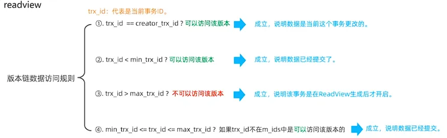

# MVCC 的基本概念

**MVCC（Multi-Version Concurrency Control）多版本并发控制** 是 InnoDB 引擎用于实现并发控制的一种机制，通过维护数据的多个版本，避免了读写冲突；是现代数据库（如MySQL）引擎实现中常用的**处理读写冲突**的手段，目的在于 **提高数据库高并发场景下的吞吐性能**。

MySQL 的 InnoDB 存储引擎的默认事务隔离级别是 **Repeatable Read （可重复读），是通过 "行级锁+MVCC"一起实现的**，正常读的时候不加锁，写的时候加锁。

MVCC 的实现依赖于以下三点：**隐藏字段、Read View、Undo log**。

另外MVCC只在 Read Committed（读已提交） 和 Repeatable Read （可重复读）两个隔离级别下工作，其他两个隔离级别和 MVCC 不兼容：

- Read Uncommitted 总是读取最新的记录行，不需要 MVCC 的支持
- Serializable 则会对所有读取的记录行都加锁，单靠 MVCC 无法完成

# MVCC 中涉及到的几个核心概念

## 当前读

当前读是指 **读取当前记录最新版本的读操作**，读取时还要保证其他并发事务不能修改当前记录。当前读会对读取的记录进行加锁。常见的**当前读**操作如下：

- `select ... lock in share mode`
- `select ... for update`
- `update`
- `insert`

## 快照读

不加锁的 `select` 操作就是快照读，即不加锁的非阻塞读。

快照读的实现是基于 MVCC 的，这样做的好处是在很多情况下避免了加锁操作，降低了开销；缺点是读到的数据并不一定是数据的最新版本，有可能是之前的历史版本。

在不同事务隔离级别下，快照读的行为如下：

- **Read Committed**：每次 `SELECT` 都会生成一个新的快照，读取最新可见数据。
- **Repeatable Read**：事务开启后，首次 `SELECT` 会创建一个快照，后续查询读取的始终是该快照的数据，保证可重复读。
- **Serializable**：快照读退化为当前读，需要加锁以保证严格的事务隔离。

## Read View

Read View 生成于事务进行快照读操作的时候，其记录并维护系统当前活跃事务的ID。Read View中包含有四个核心字段：

- `m_ids`（当前系统中活跃事务的 ID 列表）
  - 包含所有在 ReadView 创建时尚未提交的事务 ID。
  - 用于判断某行数据的版本是否由活跃事务生成，从而决定其可见性。
- `min_trx_id`（活跃事务的最小事务 ID）
  - `m_ids` 中的最小事务 ID，即当前活跃事务的最早起点。
  - 用于快速过滤比该 ID 更早的事务生成的版本，这些版本一定可见。
- `max_trx_id`（当前系统中预分配的下一个事务 ID）
  - 表示在 ReadView 创建时系统预分配的下一个事务 ID，所有大于等于该 ID 的事务未开始。（可以简单理解为当前最大事务的ID + 1）
  - 用于判断后续产生的新数据版本（由这些事务创建）对当前事务不可见。
- `creator_trx_id`（当前事务的事务 ID）
  - 表示创建该 ReadView 的事务 ID。
  - 用于确保当前事务自身的修改在快照读中始终可见（即读取自己写的数据）。

## 隐藏字段

InnoDB 为每行额外添加了 3 个字段

- DB_TRX_ID：最近修改事务ID。记录插入这条记录或最后一次修改这条记录的事务的ID。
- DB_ROLL_PTR：回滚指针。指向 Undo Log 中的回滚记录（Undo Record），而回滚记录中保存着该数据的上一个版本信息。
- DB_ROW_ID：隐藏主键。如果表结构没有指定主键，将会生成该隐藏字段。

## 事务版本号

每个事务开启之前都会从数据库获得一个自增的事务 ID， 可以从事务ID判断事务执行的先后顺序。

## Undo Log

- **Insert 操作**：

  执行 `INSERT` 操作时，产生的 Undo Log 仅用于事务回滚。在事务提交后，这部分 Undo Log 不再有用，可以立即删除。

- **Update 和 Delete 操作**：

  执行 `UPDATE` 或 `DELETE` 操作时，生成的 Undo Log 不仅在事务回滚时需要，同时还用于支持快照读（MVCC）。因此，这部分 Undo Log 在事务提交后不会立即删除，而是保留至不再被其他事务访问为止。

# 如何利用 Undo Log 实现快照读

### 1. UPDATE 操作

- **修改前记录：** 当一个事务对某行数据执行 **UPDATE** 操作时，数据库不会直接覆盖原来的数据，而是先将原始数据的副本写入 Undo Log。
- **快照读时的回溯：** 如果在当前事务（修改数据的事务）未提交时，其他事务进行快照读（比如事务 B 开始时的快照），数据库就会发现数据的最新状态与快照不一致。这时，数据库会利用 Undo Log 中保存的旧数据来“回溯”，即恢复出事务开始时的数据状态，从而保证事务 B 读取到的数据与它快照时的状态一致。

### 2. DELETE 操作

- **删除前记录：** 当一个事务执行 **DELETE** 操作时，删除的数据行不会立即从数据库中物理删除，而是把这行数据的完整内容保存到 Undo Log 中。
- **快照读时的恢复：** 如果其他事务（比如事务 C）需要通过快照读查看这行数据（因为它在事务 C 的快照中应该是存在的），数据库会从 Undo Log 中取出这行被删除的数据，提供给事务 C 读取，确保它看到的数据和事务开始时的一致。

## Undo Log 版本链

### 不同事务隔离级别生成Read View的时机

- READ COMMITTED

  在事务每次执行快照读时生成 Read View

- REPEATABLE READ

  仅在事务中第一次执行快照读时生成 Read View，后续复用该 Read View

### 版本链数据访问规则

