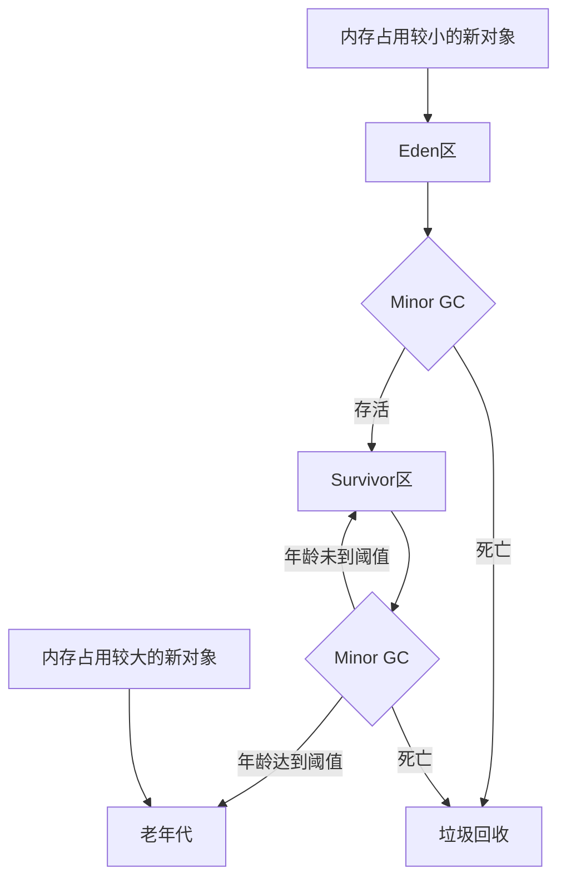

# 堆内存是做什么的

堆内存用来存放 Java 中的 **实例对象和数组**。当我们 new 一个对象或者创建一个数组的时候，就会在堆内存中开辟一段空间用于存放它们。堆内存也有一些特点：

- 堆内存是 JVM 内存中**最大**的一部分
- 堆内存是**线程共享**的，也是垃圾回收的主要回收区
- 一个 JVM 实例只存在一个堆内存
- 堆内存可以在运行时**动态**地分配大小
- 堆内存是**先进先出** FIFO 的

# 堆内存的组成部分

首先思考一个问题，为什么要分代？如果不分代，那么所有的实例对象都会存储到一起，在进行垃圾回收（GC）时，如果我们想要找到哪些对象需要被回收，需要对整个堆进行扫描，这个步骤的资源开销是非常大的。如果分代，我们将部分“朝生夕死”的对象放在一个特定的区域，那么在进行 GC 时优先回收这块区域，这样就能 **极大地提高 GC 效率**。

## 逻辑上

我们可以将 Java 堆内存的**逻辑结构**分为以下几个部分（以 JDK 8 为基准）：

- **新生代（Young Generation）**
    - **Eden 区**
    - **两个 Survivor 区（Survivor 0 和 Survivor 1）**
        - 每次 GC 中一个为 From，另一个为 To，角色交替
- **老年代（Old Generation）**
    - 存放生命周期长或经历多次 GC 的对象
- **方法区（Method Area）**
    - 存储类的元数据信息（类加载信息、方法定义等）
    - 理论上并未限定方法区的所在位置，真实位置根据 JDK 版本和虚拟机而有所不同
    - 在 JDK 1.7 及之前，方法区通过 **永久代（PermGen）** 实现，所在位置为 JVM 管理的**非堆内存**；在 JDK 1.8 及以后，方法区通过 **元空间 （Metaspace）** 实现，所在位置为本地内存。

## 物理上

堆内存**在物理上**由新生代和老年代组成，简单来说：**堆内存的大小 = 新生代的大小 + 老年代的大小**。

# 堆内存的空间分配

在默认情况下，整个堆内存中，新生代占 1/3 的堆空间，老年代占2/3 的堆空间。

对于新生代所占内存，默认情况下 Eden 区占 8/10 的新生代空间，From 区和 To 区 占 1/10 的新生代空间，即三者所占内存为 8 : 1 : 1。

所以我们可以这样理解，将整个堆内存分为 30 份，那么老年代占 20 份，Eden 区占 8 份，From 区和 To 区各占 1 份。

JVM 默认有参数 `-XX:+UseAdaptiveSizePolicy`（默认开启），会导致这个 8 : 1 : 1 比例自动变化。如果不想让这个比例发生变化，也可以关闭参数`-XX:-UseAdaptiveSizePolicy` 。

# 新生代

## 基本工作原理

新生代被分为 Eden 区和两个 Survivor 区（From Survivor 和 To Survivor），三者的空间比例为 8 : 1 : 1。一般情况下，新创建的对象都会被分配到 Eden 区（内存占用大的对象可能会被直接被放到老年代）。这些对象经过第一次 Minor GC 后，如果仍然存活，将会被移到 Survivor 区。对象在 Survivor区中每熬过一次 Minor GC，年龄就会增加 1 岁，当它的年龄增加到一定程度时，就会被移动到老年代中。

## 新生代的垃圾回收算法

因为新生代中的对象基本都是朝生夕死的，所以新生代的垃圾回收算法使用的是**复制算法**。复制算法的基本思想就是将内存分为两块，每次只用其中一块，当这一块内存用完，就将还活着的对象复制到另外一块上面。复制算法不会产生内存碎片。
在 GC 开始的时候，对象只会存在于 Eden 区和 From Survivor 区，To Survivor 区是空的。紧接着进行 GC，Eden 区中所有存活的对象都会被复制到 To Survivor 区，而在 From Survivor 区中，仍存活的对象会根据他们的年龄值来决定去向。年龄达到一定值（可以通过`-XX:MaxTenuringThreshold`来设置）的对象会被移动到老年代中，没有达到阈值的对象会被复制到 To Survivor 区。经过这次 GC 后，Eden 区和 From Survivor 区已经被清空。这个时候， From Survivor 区和 To Survivor 区会交换他们的角色，也就是新的 To Survivor 区就是上次 GC 前的 From Survivor 区，新的 From Survivor 区就是上次 GC 前的 To Survivor 区。不管怎样，都会保证 To Survivor 区是空的。Minor GC 会一直重复这样的过程，直到 To Survivor 区被填满， To Survivor 区被填满之后，会将所有对象移动到老年代中。

## 为什么要设置 Survivor 区

如果没有 Survivor 区，Eden 区每进行一次 Minor GC，存活的对象就会被送到老年代，老年代很快就会被填满，然后触发 Major GC（由于 Major GC 一般伴随着 Minor GC，所以也可以看做触发了 Full GC）。老年代的内存空间远大于新生代，进行一次 Full GC 消耗的时间比 Minor GC 长得多。频发的Full GC 消耗的时间是非常可观的，这会影响大型程序的执行和响应速度，甚至会导致某些连接因超时而发生连接错误。

## 为什么要设置两个 Survivor 区

设置两个 Survivor 区最大的好处就是 **解决了碎片化** 。整个 GC 过程中，永远有一个 Survivor是空的。

假设我们现在只有一个 Survivor 区，并且 Eden 区和 Survivor 区中各有一部分资源。现在进行 Minor GC，将 Eden 区中存活的对象复制到 Survivor 区中，此时就有可能使内存碎片化，如下图： 

内存碎片化 （Memory Fragmentation）会严重影响 Java 程序的性能。堆空间碎片化，最直接的结果就是 **堆内存中没有足够大的连续内存空间**，如果此时程序需要给一个内存需求很大的对象分配内存空间，就会出现问题，最常见的是抛出 `java.lang.OutOfMemoryError: Java heap space` 异常。顺理成章，我们应该建立两块 Survivor 区，保证每时每刻都有一块 Survivor 区是空的，另一个非空的 Survivor 区无碎片，如下图：

# 老年代

大概有以下四种情况会使 Java 对象进入老年代：

- 创建大对象
- 对象年龄达到阈值
- Minor GC 时发现存活的对象在 To Survivor 区存不下
- 动态选择

## 大对象创建时直接进入老年代

大对象就是指需要大量连续内存空间的 Java 对象，最典型的大对象便是很长的字符串，或者元素数量很庞大的数组。

大对象，甚至是“短命”大对象，对虚拟机的内存分配来说是不折不扣的坏消息，我们写程序的时候应注意避免。在 Java 虚拟机中要避免大对象的原因是：在分配空间时，它容易导致内存明明还有不少空间时就提前触发垃圾收集，以获取足够的 **连续空间** 才能安置好它们，而当复制对象时，大对象就意味着高额的内存复制开销。

HotSpot 虚拟机提供了 `-XX：PretenureSizeThreshold` 参数，指定大于该设置值的对象直接在老年代分配，这样做的目的就是避免大对象在 Eden 区及两个 Survivor 区之间来回复制，产生大量的内存复制操作。

## 对象年龄达到阈值

JVM 为每个对象定义了一个对象年龄计数器，存储在对象头中。HotSpot 虚拟机中多数的收集器都采用了 **分代收集** 来管理堆内存，对象通常在 Eden 区诞生，如果经过第一次 Minor GC 后仍存活，并且能被 Survivor 区容纳的话，该对象会被移动到 Survivor 区中，并且将其对象年龄设为 1 岁。对象在 Survivor 区中每熬过一次 Minor GC，年龄就增加 1 岁，当它的年龄增加到一定程度（默认为 15），就会晋升到老年代。对象晋升老年代的年龄阈值，可以通过参数 `-XX:MaxTenuringThreshold` 设置。

## Minor GC 时发现存活的对象在 To Survivor 区存不下

我们可以结合 Minor GC 的过程来理解这一情景：

- Minor GC 发生时，首先会扫描 Eden 区和 From Survivor 区，找出仍然存活的对象（通常是被引用的对象）。
- 存活的对象会被复制到 To Survivor 区（如果年龄足够大，可能会晋升到老年代）。
- 如果 To Survivor 区能够容纳存活的对象，则对象顺利存放。
- 如果 **To Survivor** 区的**空间不足：**
    - 一部分对象会被直接转移到 **老年代**，这会加快老年代的填充速度，从而增加 Full GC 发生的可能性。
    - 如果老年代也没有足够的空间，可能会触发 **Full GC**，甚至导致 **OOM**。

## 动态选择

为了能更好地适应不同程序的内存状况，HotSpot 虚拟机并不是永远要求对象的年龄必须达到 JVM 参数中的设定值才能晋升老年代。如果**在 Survivor 区中，相同年龄所有对象大小的总和大于 Survivor 区的一半**，年龄大于或等于该年龄的对象就可以直接进入老年代。

---

参考文章：

- [对象进入老年代的4种情况 - -Lucas - 博客园](https://www.cnblogs.com/xinay/p/16625952.html)
- [为什么新生代内存需要有两个Survivor区_为什么要分eden和survivor?为什么分两个survivor-CSDN博客](https://blog.csdn.net/antony9118/article/details/51425581)
- 《深入理解 Java 虚拟机（第三版）》
